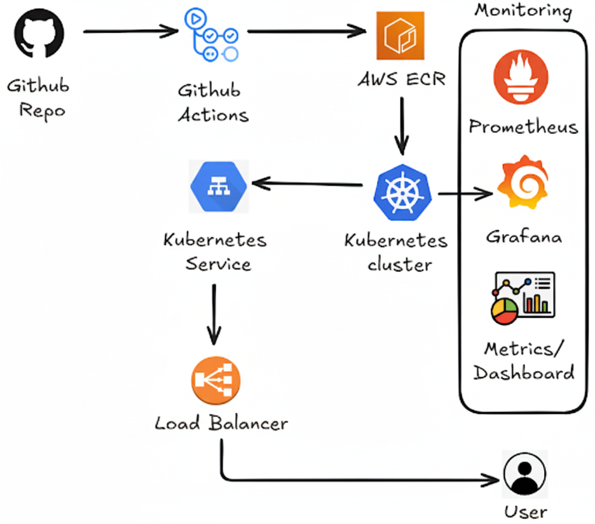

# Justin's LLMOps Real-Time Inference Pipeline

[](https://opensource.org/licenses/MIT)
[](https://www.python.org/downloads/)

A production-grade deployment of a Large Language Model (LLM) inference service for real-time requests using BentoML and AWS EKS.

### Architecture



## Prerequisites

- Python 3.9+
- Docker
- AWS CLI configured
- kubectl and Helm
- Bentoml

For frontend (optional):
- Flask (install with `pip install flask`)

## Local Development

### Clone and Setup
```bash
git clone https://github.com/eliharoun/llmops-realtime-inference-pipeline.git
cd llmops-realtime-inference-pipeline
pip install -r requirements.txt
```

### Run Locally
```bash
bentoml serve src/service.py:LLMInference --reload
```

### API Endpoints
- **POST /generate**: Generate text response  
  Request: `{"prompt": "string", "max_length": 50}` (optional max_length)  
  Response: `{"status": "success", "response": "generated text", "model": "microsoft/DialoGPT-medium"}`

- **POST /health**: Health check  
  Response: `{"status": "healthy", "model": "microsoft/DialoGPT-medium"}`

### Test
```bash
curl -X POST http://localhost:3000/generate -H "Content-Type: application/json" -d '{"prompt": "Hello, how are you?"}'
curl -X POST http://localhost:3000/health
```

### Frontend (Optional)
For a web interface to test the API:
```bash
cd frontend
pip install flask requests
python cors-proxy.py
```

Open browser to: http://localhost:3030

This provides a UI for interacting with your local BentoML service.

## Production Deployment

### EKS Cluster Setup
```bash
eksctl create nodegroup \
  --cluster llm-inference-cluster \
  --name standard-workers-m5 \
  --node-type m5.xlarge \
  --nodes 2 \
  --nodes-min 2 \
  --nodes-max 10 \
  --region us-east-1 \
  --managed
```

### Helm Deployment
```bash
helm upgrade --install llm-inference-service ./k8s/llm-inference-service
```

### Pod Management

Log pods:
```bash
kubectl logs -f deployment/llm-inference-service -n llm
```

Describe pod:
```bash
kubectl describe pod llm-inference-service-75db87846d-t88gr -n llm
```

Watch pods:
```bash
kubectl get pods -n llm -w
```

Delete pods:
```bash
kubectl delete pods -n llm --all
```

### BentoML Operations

Delete old builds:
```bash
bentoml delete llminference --yes
```

Build image:
```bash
bentoml build
```

List and get images:
```bash
bentoml list
bentoml get <Bento Image>
```

Serve locally for testing:
```bash
BENTO_SERVICE=$(bentoml list --output json | jq -r '.[0].tag')
bentoml serve $BENTO_SERVICE
curl -X POST http://localhost:3000/health
```

Containerize and push to ECR:
```bash
bentoml containerize llm_inference:latest --platform linux/amd64

export AWS_ACCOUNT_ID=$(aws sts get-caller-identity --query Account --output text)
docker tag llm_inference:<TAG> $AWS_ACCOUNT_ID.dkr.ecr.us-east-1.amazonaws.com/llm-inference:latest
docker push $AWS_ACCOUNT_ID.dkr.ecr.us-east-1.amazonaws.com/llm-inference:latest
```

Update deployment with new image:
```bash
kubectl set image deployment/llm-inference-service llm-inference-service=546338373444.dkr.ecr.us-east-1.amazonaws.com/llm-inference:$NEW_TAG -n llm
kubectl rollout restart deployment/llm-inference-service -n llm
kubectl rollout status deployment/llm-inference-service -n llm
```

## Monitoring & Observability

Install Prometheus + Grafana:
```bash
helm repo add prometheus-community https://prometheus-community.github.io/helm-charts
helm install prometheus prometheus-community/kube-prometheus-stack
```

Port forward Grafana:
```bash
kubectl port-forward svc/prometheus-grafana 3000:80
```

Access Grafana in browser at: http://localhost:3000

Default credentials:
- Username: admin
- Password: prom-operator (or check with `kubectl get secret prometheus-grafana -o jsonpath="{.data.admin-password}" | base64 --decode`)

## Project Structure

- `src/service.py`: BentoML inference service using microsoft/DialoGPT-medium
- `k8s/`: Helm charts for Kubernetes deployment
- `frontend/`: Web frontend (optional)
- `requirements.txt`: Python dependencies

## License

MIT - see [LICENSE](LICENSE)
